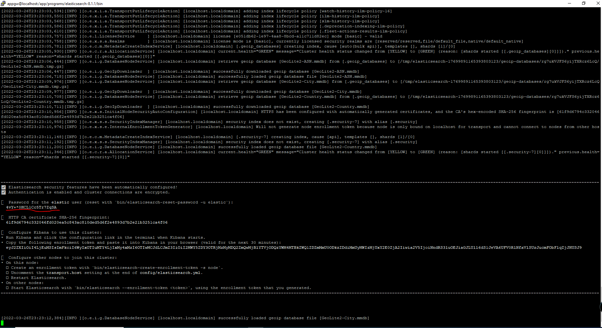

# Cài đặt Elastic search trên centos

 * Tải bản cài đặt linux x86_64 trên trang : https://www.elastic.co/downloads/elasticsearch
 * Thực hiện giải nén file: **elasticsearch-8.1.1-linux-x86_64.tar.gz** và copy ra phân vùng khác
   * `tar -xf elasticsearch-8.1.1-linux-x86_64.tar.gz -C /app/programs`
 * Thực hiện start elasticsearch:
   * `cd /app/programs/elasticsearch-8.1.1/bin `
   * `./elasticsearch`
   * Sau khi chạy thì elastic sẽ print ra password ở màn hình console, username mặc định của elastic là 
   `elastic` và mật khẩu chính là ở console đó, như ở trong ví dụ mật khẩu là vùng bôi đỏ trên ảnh:
   * 