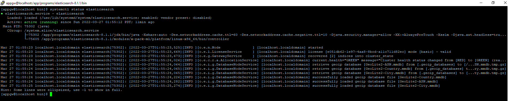
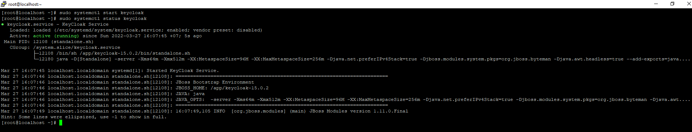

# Cách tạo service centos từ file sh, không cần truy cập vào folder để bật tắt service, tự động start khi server reboot
 * Sẽ có 2 loại service là chạy bằng root hoặc là chạy bằng account non root (appgw)
 ## Như elasticsearch thì nó không chạy được bằng account root, ta chạy service bằng account non root là appgw
 * Chuyển về account appgw bằng lệnh: `su - appgw` rồi nhập mật khẩu appgw vào
 * Dùng Vim hoặc là Winscp tạo file ở trên thư mục : `/usr/lib/systemd/system`, giả sử muốn tạo service cho elasticsearch, 
 ta sẽ tạo file : `elasticsearch.service` => file có đường dẫn: `/usr/lib/systemd/system/elasticsearch.service`
 * Nội dung của file sẽ như sau:
```
[Unit]
Description=elasticsearch

[Service]
Type=simple
User=appgw
Group=wheel
ExecStart=/app/programs/elasticsearch-8.1.1/bin/elasticsearch
TimeoutStartSec=0
RemainAfterExit=yes

[Install]
WantedBy=default.target
   ```
 * Sau đó dùng lệnh để nó tự bật lúc server start : `systemctl enable elasticsearch`
 * Start service bằng lệnh: `systemctl start elasticsearch`
 * Kiểm tra status của service bằng lệnh: `systemctl status elasticsearch`
 
 ## Tạo service chạy bằng account root (keycloak hay một số thằng khác)
 * Chuyển về account root bằng lệnh: `su - root` rồi nhập mật khẩu root vào
 * Dùng Vim hoặc là Winscp tạo file ở trên thư mục: `/etc/systemd/system`, giả sử muốn tạo service keycloak thì sẽ tạo file: `keycloak.service`
 => file có đường dẫn : `/etc/systemd/system/keycloak.service`
 * Nội dung của file sẽ như sau:
```
[Unit]
Description=KeyCloak Service
After=network.target

[Service]
Type=simple
User=root
ExecStart=/app/keycloak-15.0.2/bin/standalone.sh
Restart=on-abort

[Install]
WantedBy=multi-user.target
```
* Sau đó dùng lệnh để nó tự bật lúc server start : `sudo systemctl enable elasticsearch`
* Start service bằng lệnh: `sudo systemctl start elasticsearch`
* Kiểm tra status của service bằng lệnh: `sudo systemctl status keycloak`
 